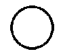
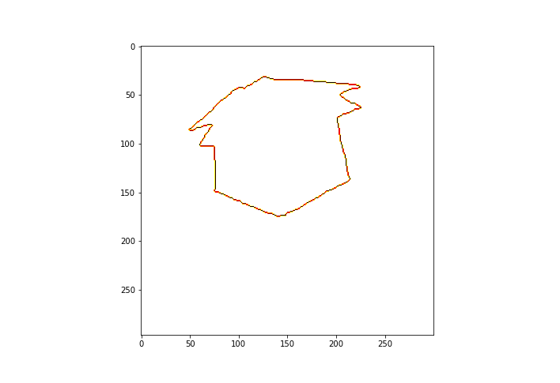

# Computer Vision Techniques

> *all credit goes to [filo](https://github.com/FilobaterGeorge)*

## Hough Transform for Circles

* Input image:

 
      

* Hough Space:

<figure>

 
      
    <figcaption>
<i> conitnuous slicing in the z-axis </i><\p> </figcaption>

</figure>

* Input image:

 
      

* Hough Space:

<figure>

 
      
    <figcaption>
<i> conitnuous slicing in the z-axis </i>
 </figcaption>

</figure>

## Boundary Tracing (8-connectivity)

* Input image:

 
      

* Border extracted:

 
      

